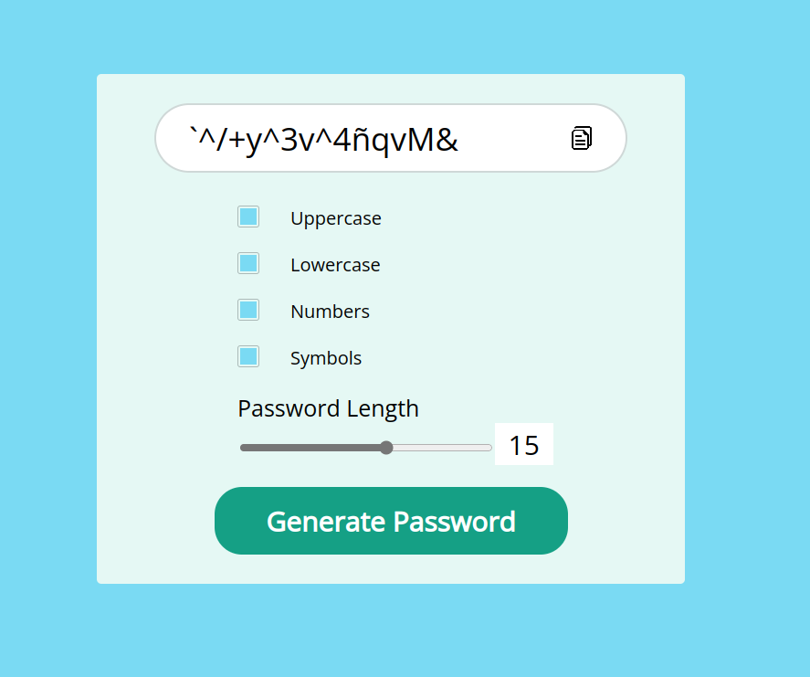

## Generate-Password App

El App "Generate-Password" es una aplicacion web muy util, ya que te permite crear claves aleatorias y tu decides el nivel de dificultad para tus claves.
podras incluir mayusculas, minusculas, números, símbolos y el numero de caracteres (como minimo de 8 y maximo 20 caracteres)

## ¿Como usar el app?

- Seleccionar que tipo de caracter quieres marcando el checkbox
- Mover el rango de caracteres que deseas.
- Presionar el boton "Generate Password"
- Se generara el password y presionar el icono de copiar que esta a lado del password generado y pegarlo donde lo necesites y listo

## Datos de la creacion de la app.

Esta app fue ralizada con React, fue muy interesante desarrollar esta App, aparentemente parece una aplicacion sencilla, pero a la hora de desarrollarla resulta que es un poco extenso me gusto mucho trabajar con en input range y vincular las funcionabilidades con los otros componentes, espero que les haya gustado mi codigo y animo a que puedan realizar su propio "Generator Password".
